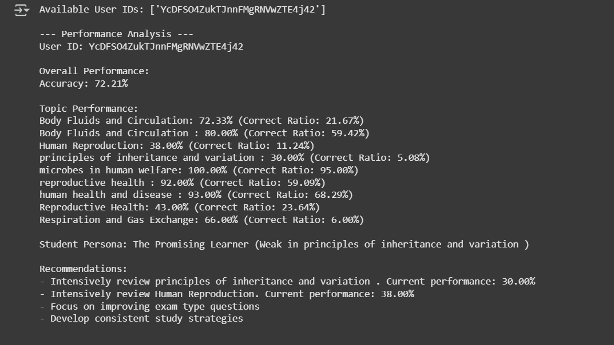

## Project Overview
A comprehensive Python-based solution for analyzing NEET quiz performance, providing personalized insights and recommendations for students.

## Key Features
- Detailed quiz performance analysis
- Personalized student insights
- Topic and difficulty-level recommendations
- Error-robust data processing

## Setup Instructions

### Prerequisites
- Python 3.8+
- Libraries:

  ```pip install requests pandas numpy```

### Installation
- Clone the repository
- Install dependencies
- Run the Jupyter Notebook or Python script

### Data Requirements

- Quiz performance JSON data
- Historical quiz data endpoint
- User-specific quiz information

 ## Usage Example
 
### Initialize analyzer
```analyzer = QuizAnalyzer(CURRENT_QUIZ_URL, HISTORICAL_QUIZ_URL)```

### Analyze specific quiz or user performance
```analysis_results = analyzer.analyze_performance(user_id)```

## Approach Description

## Data Retrieval: Fetch quiz data from API endpoints
###Performance Metrics:
- Calculate overall accuracy
- Analyze topic-wise performance
- Assess difficulty level challenges

## Insights Generation:

- Create student persona
- Identify strengths and weaknesses
- Generate personalized recommendations

# Visualization Screenshots
Screenshots of key visualizations and insights summary2.png

